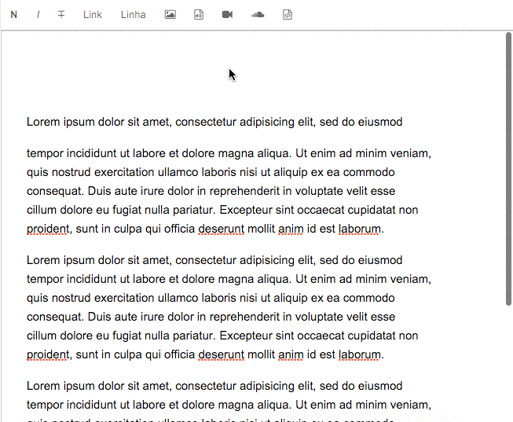

##Redactor-soundcloud-plugin
Embed your soundcloud track into redactor

###How to install
using __bower__:

```
	bower install redactor-soundcloud-plugin	
```

using __npm__:

```
	npm install redactor-soundcloud-plugin
```

###Usage
#####import redactor-soundcloud.js

if you installed with __bower__:

```
<script src="bower-components/redactor-soundcloud-plugin/redactor-soundcloud.js"></script>
```

if you installed with  __npm__:

```
<script src="node_modules/redactor-soundcloud-plugin/redactor-soundcloud.js"></script>
```

#####insert plugin in redactor config, example:

```
$('#redactor').redactor({
	plugins: ['soundcloud']
});

```

#####READY! see example:



Thanks [@lucasMezencio](https://github.com/lucasmezencio) for your review

Made with 3> by [@dielduarte](https:/github.com/dielduarte)
